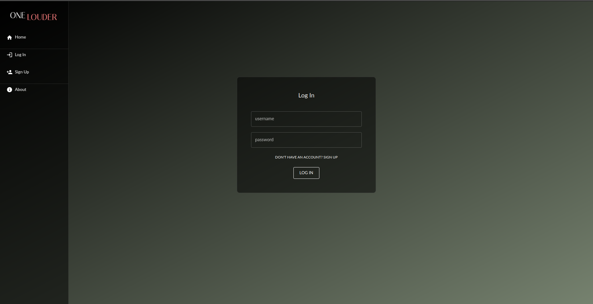
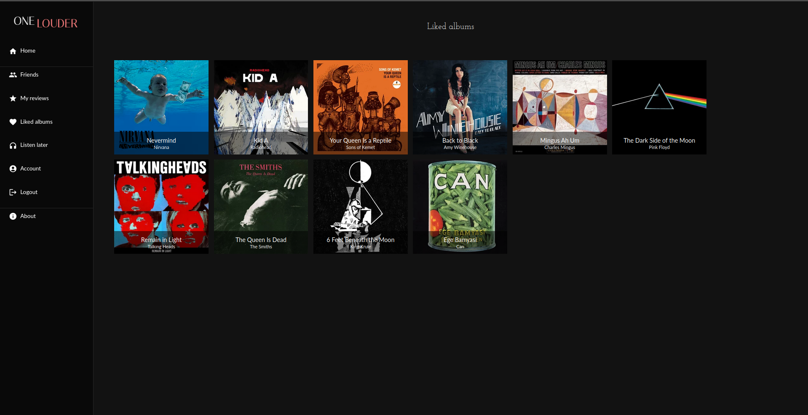
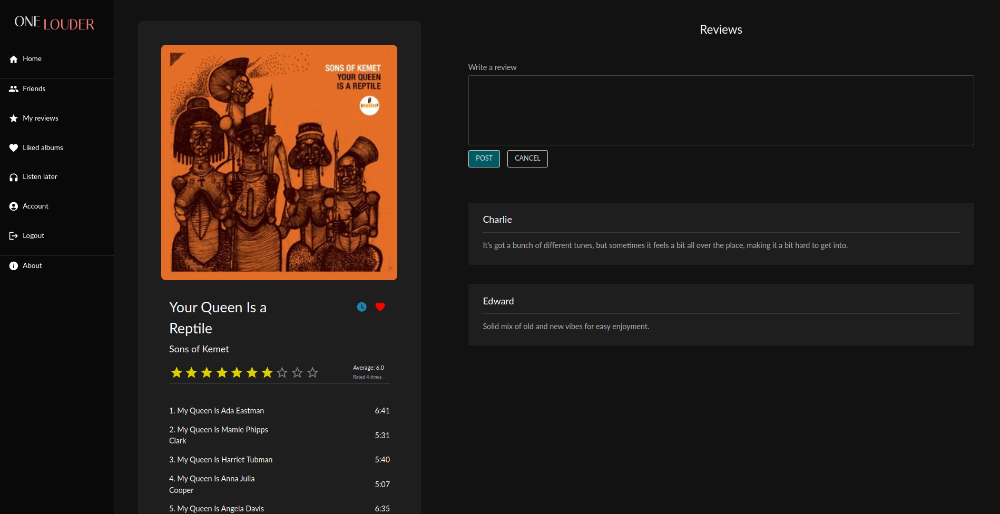

This project was developped as part of the Web Application Project (iti0302) course in Taltech.

## OneLouder

#### Introduction

A music app designed for enthusiasts who want a straightforward way to manage their music preferences.

#### Author

- Morten Tšinakov

#### Technologies Used

- React
- React DOM
- Material UI

#### Setting up development environment

Before starting the front-end, you should run the database and back-end.

1. Clone the project
2. Run 'npm install'
3. Run 'npm start'

#### Screenshots of the app

    
    
    

