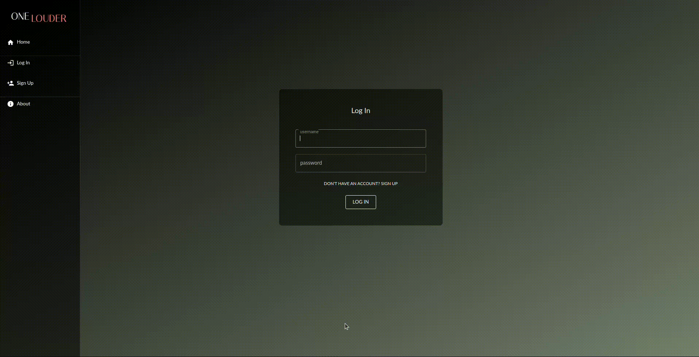
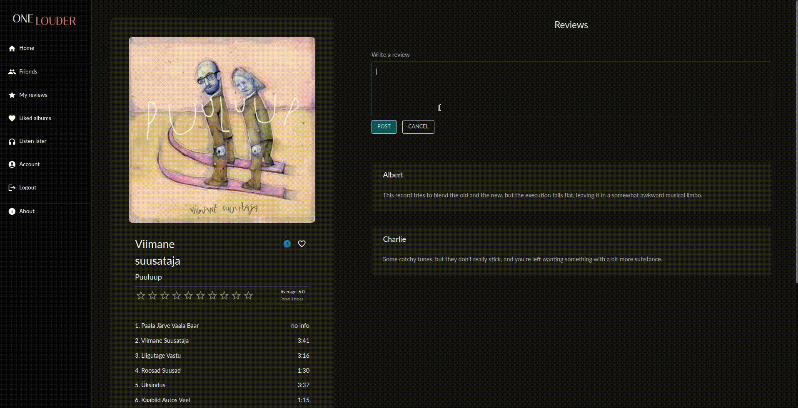
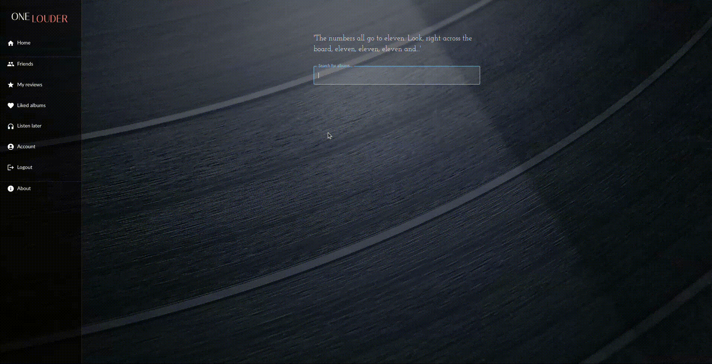

This project was developped as part of the Web Application Project (iti0302) course in Taltech.

## OneLouder

#### Introduction

A music app designed for enthusiasts who want a straightforward way to manage their music preferences.

#### Author

- Morten Tšinakov

#### Technologies Used

- React
- Material UI

#### Setting up development environment

To run the front-end you need to install node.js and npm.
Before starting the front-end, you should run the database and back-end.

1. Clone the project
2. Run ```npm install``` command (from the directory where 'package-lock.json' file is located)
3. Run ```npm start``` command (from the directory where 'package-lock.json' file is located)

#### Screenshots of the app

<table>
  <tr>
    <td></td>
    <td></td>
    <td></td>
  </tr>
</table>

#### GIF

<table>
  <tr>
    <td></td>
    <td></td>
    <td></td>
